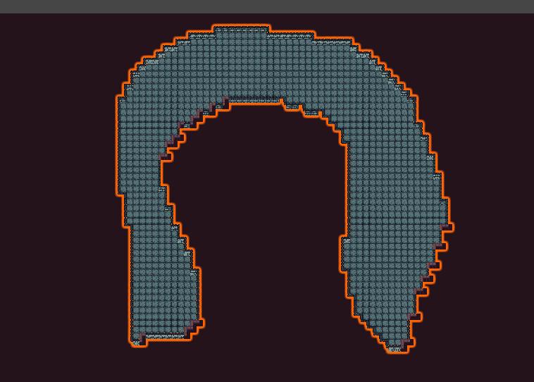

# Escape the Gungeon!
A game dev project

## Table of Contents
- [Creating a Level](#creating-a-level)
    - [Setting Up the Scene](#setting-up-the-scene)
    - [Creating Tilemaps](#creating-tilemaps)
    - [Adding the Player](#adding-the-player)
- [Setting Up Navigation Mesh](#setting-up-navigation-mesh)
- [Adding Mobs](#adding-mobs)
- [Level Completion](#level-completion)
    - [Completion Statue](#completion-statue)
    - [Level Requirements](#level-requirements)
        - [Pedestals Activated](#pedestals-activated)
        - [Enemy Clear](#enemy-clear)

---

## Creating a Level

**Automated way!**
There is now an automated way for setting up a level.
1. Go to `Tools > Setup Level`
2. As long as there was no error, all the steps from below should have been created automatically.

### Setting Up the Scene
1. Navigate to the `Assets/Scenes` folder.
2. Create a new Scene, name it as desired, and open it.  
   
3. Delete all objects in the hierarchy.
4. Create an empty GameObject and rename it to `LevelManager`.
5. Attach a `LevelManager` component to the object.
6. Assign a transform as the player's spawn position.  
   

### Creating Tilemaps
7. Create two `Tilemap` objects: `Create > 2D Object > Tilemap > Rectangular`.  
   
8. Name them `Ground` and `Walls`.
   
9. Set the `Grid`'s collision layer to `World` and change its children accordingly.  
   
10. Add a `TilemapCollider2D` to `Walls`.
11. Open the `Tile Palette` window and start drawing tiles.
12. Use the selected tile for walkable areas, and the plain one for background tiles.  
    
13. Ensure that walkable and background tiles are on separate tilemaps.  
    

### Adding the Player
14. Go to `Assets/Main/Player` and drag the `Player` prefab into the level.
15. The scene will appear dark—add a `Global Light 2D` and adjust its intensity.
16. Ensure the `Spawn Position` is correctly set for the player.
17. Run the game to test the setup.

---

## Setting Up Navigation Mesh
For mobs to use the `Navigation` API, a `NavigationMesh` must be configured.

1. In the scene, create an empty GameObject named `Nav`.
2. Add `Navigation Surface` and `NavigationCollectSources2D` components.  
   
3. Click `Rotate Surface to XY` in `NavigationCollectSources2D` to remove warnings.
4. Add a `Navigation Modifier` to the `Walls` tilemap.
5. Enable `Override Area` and select `Walkable`.  
   
6. In the `Nav` object, set `Navigation Surface > Advanced > Default Area` to `Not Walkable`.
7. Click `Bake`—the navigation mesh should appear blue.  
   

---

## Adding Mobs
1. Ensure the `NavigationMesh` is set up.
2. Drag and drop a mob prefab from `Assets/Main/World/Mobs` into the scene.

---

## Level Completion
The `LevelManager` manages level completion through:
- **Completion Statue**: Appears when the level is completed.
- **Requirements**: Objectives required to complete the level.

### Completion Statue
- Located in `Assets/Main/World/Objects`.  
  
- Initially disabled; activates upon level completion.
- Rewards the player with a `StatUpgrade`.
- Players can choose **one** upgrade (left or right).  
  

### Level Requirements
Level requirements define objectives for completion.
- Shown in the **HUD** as objectives.
- Added as components to the `LevelManager`.
- Be careful! Adding `Enemy Clear` without enemies results in an instantly completed level.

#### Pedestals Activated
- All `Pedestals` in the level must be activated.

#### Enemy Clear
- All enemies (base class `MobController`) must be defeated.

---

### Doors & Keys
- Located in `Assets/Main/World/Objects`.
- By default door can be opened without any requirements.
- To add a lock / key requirement, simply add a `Key` prefab in the level and add it to the keys required in the `Door`

THE END
